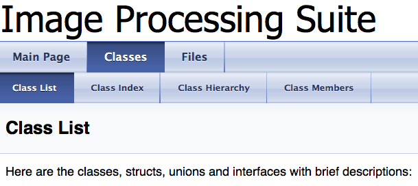
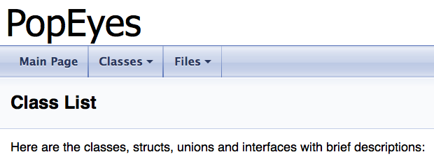

This is a easy start guide which contains some basic Doxygen config tag introduction.

<!--more-->

Generate a Doxygen config file named *Doxyfile*
: `doxygen -g Doxyfile`

Use Doxygen with that config file *Doxyfile* for generating docs
: `doxygen Doxyfile`

Change the project name that will be displayed in the manual
: `PROJECT_NAME           = "Cool Project"`

Select which files are used for generating the doc
: `INPUT                  = ../include ../src`

Get rid of “The documentation for this class was generated from the following files”
: `SHOW_USED_FILES        = NO`

Or remove the absolute path and just show file names
: `FULL_PATH_NAMES        = NO`

Or remove portion of the absoute path
: `STRIP_FROM_PATH        = /Users/myName/Documents/`

Also document private members
: `EXTRACT_PRIVATE        = YES`

Include a tree hierarchy at the left side of the page
: `GENERATE_TREEVIEW      = YES`

Remove quick index tab(s)
: `DISABLE_INDEX          = NO`

#### Something Else
I used Doxgen in 2016 and the html pages generated showed an expanded class list, class hierarchy, class members, etc. However, in 2018 Doxygen seemed to have changed this presentation. Indeed, an inverted triangle icon is used for those tabs. The problem is that clicking on "Classes"  directly jumps to the class list. While the pages of class hierarchy and others still get generated, I cannot directly access them anymore with the default setting. Maybe some simple code change in the html fies will solve this problem, but that's something I need to dip into a little before I figure it out.

Here are the screenshots to demonstrate the difference I mentioned above.

For the full documentation please visit [Doxygen Config Manual](http://www.stack.nl/~dimitri/doxygen/manual/config.html).

